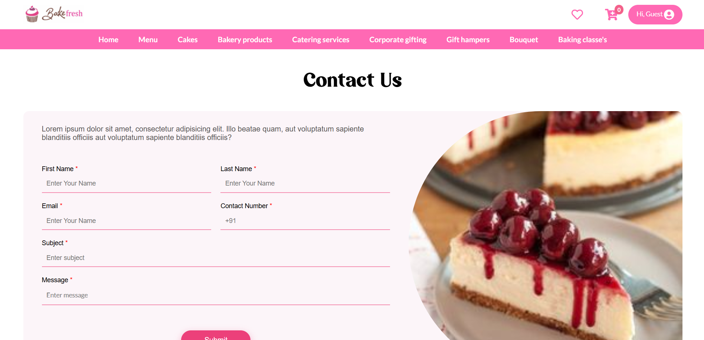
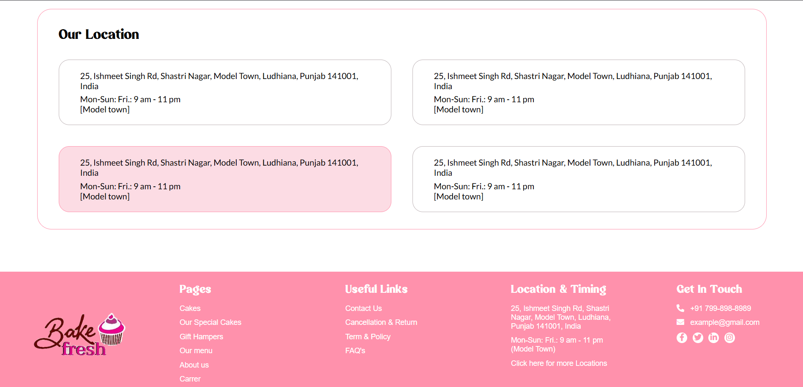

# Bakefresh

BakeFresh.in is a modern and visually rich cake shop website, designed to showcase a premium online bakery experience. This project is inspired by platforms like Zomato but tailored specifically for a bakery and dessert brand. Built using HTML and CSS, it offers an elegant and responsive UI that allows users to explore delicious cakes, gift hampers, and custom-made bakery items with ease.

Project Highlights
Clean and modern homepage layout with high-quality visuals

Detailed product sections like Cakes, Special Cakes, Gift Hampers, and more

Fully responsive design for both desktop and mobile views

Interactive navigation menu and custom font integration

Visual appeal with featured banners, gallery, and call-to-action sections

Contact form and location details included in the footer

**Technologies Used:**

HTML: For structuring the content and layout of the web pages.

CSS: For styling the application and ensuring a visually appealing design.

Here, the Preview Image of the Zomato clone:

